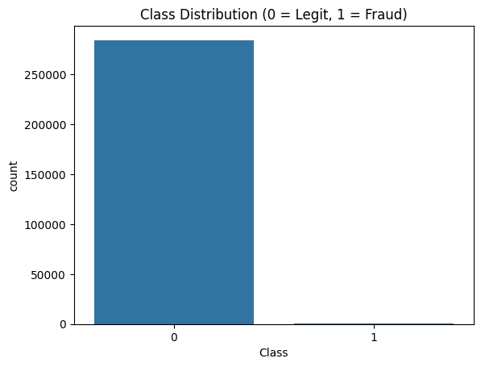
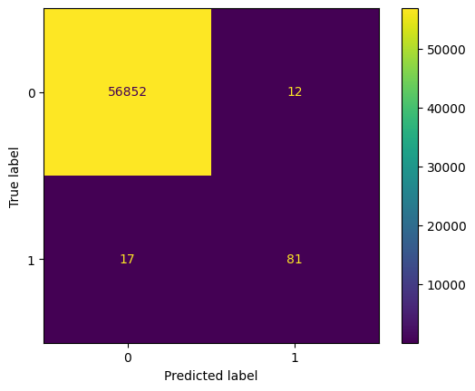

# 💳 Credit Card Fraud Detection

Detecting fraudulent credit card transactions using machine learning, SMOTE oversampling, and a Random Forest classifier.

---

## 🚀 Project Overview

Credit card fraud is rare but costly. This project focuses on detecting fraudulent transactions in a **highly imbalanced dataset** where frauds account for **less than 0.2%** of all records.

To address this, I:
- Used **SMOTE** to rebalance the data
- Trained a **Random Forest model**
- Achieved strong fraud detection performance without overfitting


To make an API call using FastAPI:
  - I did use prompt enegineering skills to create a data set.
  - The data set generate input for the pre-trained model and runs tests on it.

---

## 📂 Project Structure

```
fraud-detector/
├── app/
│   └── main.py
├── data/                  # Input CSV (ignored in repo)
├── model/                 # Trained model (.pkl)
├── notebooks/
│   └── EDA.ipynb          # Visualizations + performance
├── src/
│   ├── preprocessing.py   # Scaling, train/test split, SMOTE
│   ├── train_model.py     # Model training and saving
│   └── kaggle_data.py     # Automated Kaggle dataset download
├── .gitignore
├── requirements.txt
└── README.md
```

---

## 🧠 Techniques Used

| Technique        | Description |
|------------------|-------------|
| `SMOTE`          | Synthetic oversampling to balance fraud class |
| `RandomForest`   | Ensemble model for classification |
| `StandardScaler` | Feature normalization |
| `train_test_split` | Holdout validation (with stratification) |
| `joblib`         | Saving trained model for deployment |

---

## 🧪 Model Performance

| Metric   | Value |
|----------|-------|
| Accuracy | 99.8% |
| Recall (fraud) | **83%** |
| Precision (fraud) | **87%** |
| F1-Score (fraud) | **0.85** |

📌 Model tested on clean, **unseen** data (no data leakage).  
✅ SMOTE applied only to training set.

---

## 📊 Exploratory Data Analysis

- **Class Imbalance**  
  

- **Confusion Matrix**  
  

---

## 📦 How to Use

### Step 1: Download the dataset
```bash
python src/kaggle_data.py
```

### Step 2: Train the model
```bash
python src/train_model.py
```

### Step 3 (Optional): Run visualizations
```bash
jupyter notebook notebooks/EDA.ipynb
```

### Step 4:  Test the API Call
```bash
python app/main.py
```
---

## 🔮 What's Next


✅ **Phase 1**: Model + EDA (complete)  
✅ **Phase 2**: Build an API using **FastAPI**  
🔜 **Phase 3**: Create a web app with **Vercel v0** or Streamlit  
🔜 **Phase 4**: Deploy & share!

---

## 👨‍💻 Author

Rbhu Gandhi  
📧 rbhu22@gmail.com  
🌐 https://www.linkedin.com/in/rbhu-gandhi-16b080195/

---

> ⚠️ This project uses real anonymized transaction data. Please use ethically.
